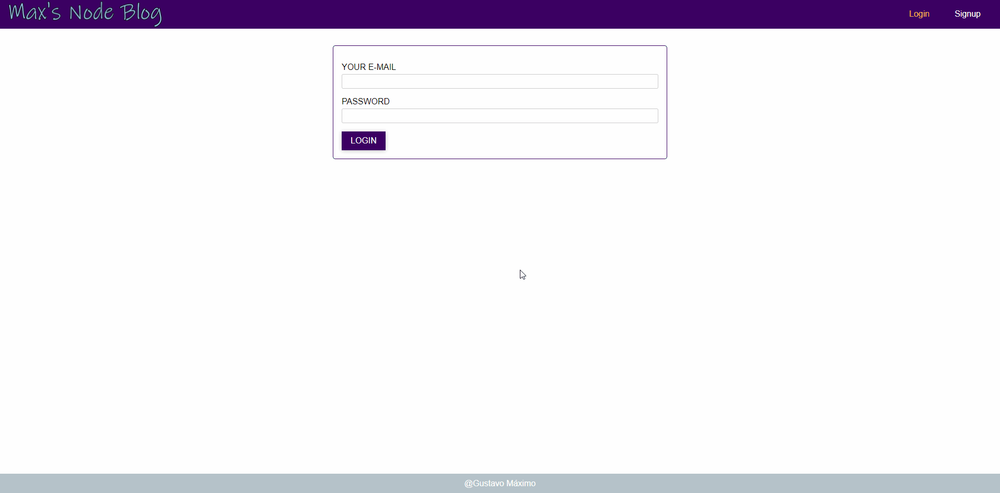
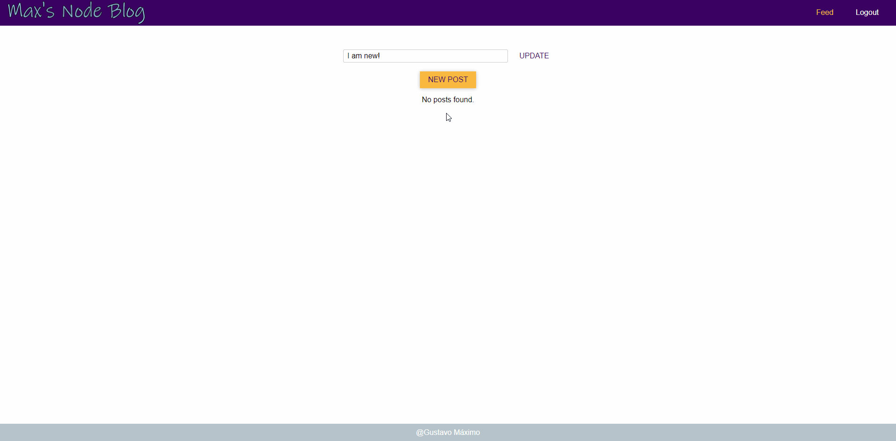
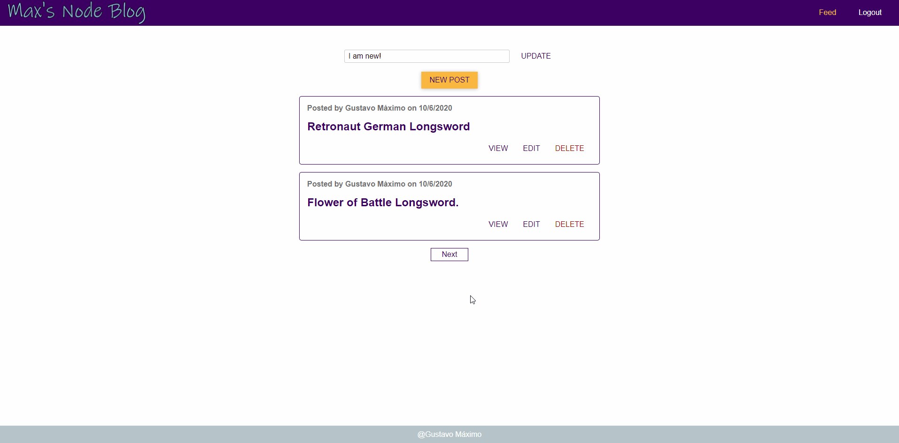
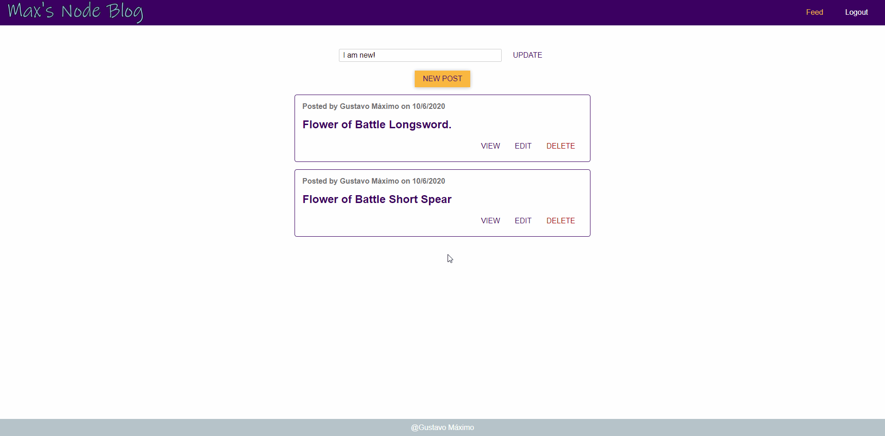

<p align="center">
    
</p>

## Max's Node Blog - Front-End.

> GraphQL/Node.js Learning Project intended to upgrade my back-end skills.

## [:fire: Heroku URL :fire:](https://maxs-node-blog.herokuapp.com/)

## Usage example

This is the front-end for [Max's Node Blog Back-End](https://github.com/GoldenMaximo/Maxs-Node-Blog-Backend).
This is social networking type blog. Create an account, post pictures with descriptions and see other user's posts.

## Built With

#### Currently in-use:

- [React.js](https://nodejs.org/en/) - JavaScript Framework
- [GraphQL](https://graphql.org/) - API/Query Language

## Inspirations and resources

- [NodeJS - The Complete Guide (MVC, REST APIs, GraphQL, Deno)](https://www.udemy.com/course/nodejs-the-complete-guide/)

I combined my creative freedom with the knowledge gained in the course above to make this application.

## DEMO

### Signup and Login



### Post Creation



### Pagination & Deletion



### User Status Update



## Installation

_Make sure to have [Git](http://git-scm.com/) and [Node.js](http://nodejs.org/) 10.0.0 (or higher) installed._

1. Clone it or fork it.

2. Once you have your local copy, install its dependencies using either Yarn:

```
yarn
```

or npm:

```
npm install
```

or the best:

```
pnpm install
```

## Running

After installed, you can start the application by running it with Yarn/pnpm:

```
yarn/pnpm start
```

or npm:

```
npm run start
```

_This will start the server at `localhost:3000`._

## Meta

Gustavo Máximo – gfmaximo97@gmail.com

Logo made with Gimp. Font used is Ink Free.

## Contributing

I'm not currently accepting pull requests as this is a personal project for both learning and career aspiration purposes.
Feel free to fork it however.

## License

This repository is licensed under [MIT](https://opensource.org/licenses/MIT)
